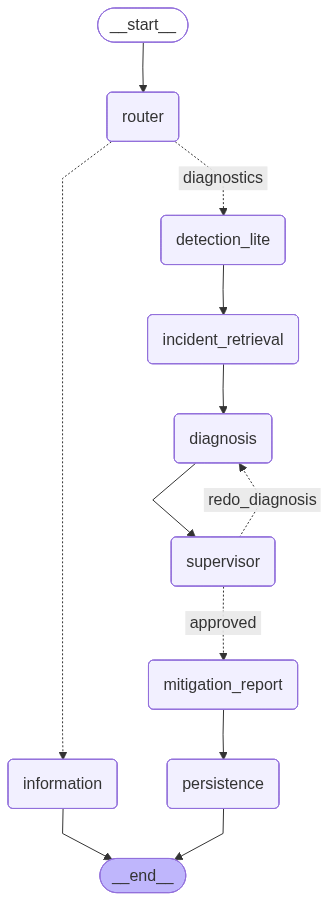
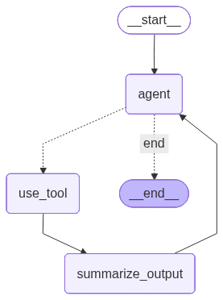

# AIOps Kubernetes Diagnostics Agent

A multi-agent Kubernetes diagnostics system that combines:

- a **LangGraph-based workflow** for routing, diagnosis, supervision, and reporting,
- a **Kubernetes MCP server** for safe observability and cluster tooling,
- **Chroma MCP / ChromaDB** for incident-history retrieval and persistence,
- **AIOpsLab** for benchmark environments, fault injection, and evaluation.

## Overview

This project has two graphs one outer workflow for all the agents and inner loop for agents inside logic.

### 1. Outer workflow graph
The outer graph controls the full incident lifecycle:



- route the request,
- answer informational questions directly,
- perform lightweight triage,
- retrieve similar historical incidents,
- run diagnosis,
- validate diagnosis with a supervisor,
- generate mitigation/report output,
- persist new incident knowledge.

### 2. Inner agent execution loop
Each reasoning-heavy agent can use an internal loop:



This allows the system to:

- reduce token usage,
- keep context focused on structured evidence rather than raw logs and metrics,
- improve repeatability across diagnostic stages,
- reuse the same execution pattern across multiple agents.

#### Persistence
Stores incident knowledge back into the incident-history system when appropriate.

This is used to improve retrieval for future incidents.

---

## Architecture

This project is intended to work alongside two external components:

### 1. Kubernetes-Mcp
Our existing MCP server repository acts as the observability and tooling layer.

Responsibilities include:

- Kubernetes API access,
- Prometheus metrics access,
- Jaeger trace access,
- Neo4j topology queries,
- safe shell / kubectl execution,
- exposing these capabilities through MCP tools.

### 2. AIOpsLab
AIOpsLab is used as the benchmark and fault-injection environment.

Responsibilities include:

- deploying benchmark applications,
- injecting faults,
- running workloads,
- evaluating diagnosis and mitigation performance.

### 3. Chroma MCP / ChromaDB
Used as the incident-history layer.

Responsibilities include:

- retrieval of similar incidents,
- metadata filtering,
- storing structured incident summaries,
- enabling incident-guided diagnosis.

---

## Tools Assigned to Agents


### 1. Information Agent

Purpose:
- Answer informational Kubernetes / observability questions
- Avoid deep diagnosis
- Stay lightweight and safe

Assigned tools:
- `get_cluster_overview`
- `get_pods_from_service`
- `get_services_from_pod`
- `exec_shell`

Examples of acceptable informational shell usage:
- `kubectl get ns`
- `kubectl get svc -A`
- `kubectl get pods -A`
- `kubectl config current-context`


### 2. Detection-Lite Agent

Purpose:
- Perform cheap triage
- Build a compact incident fingerprint
- Identify likely affected services or pods
- Collect enough evidence for retrieval and handoff to diagnosis

Assigned tools:
- `get_backend_status`
- `get_cluster_overview`
- `get_service_triage_metrics`
- `get_pod_triage_metrics`
- `summarize_service_logs`
- `summarize_pod_logs`

Recommended order:
1. `get_backend_status`
2. `get_cluster_overview`
3. if Prometheus is available:
   - `get_service_triage_metrics`
   - `get_pod_triage_metrics`
4. if logs are needed:
   - `summarize_service_logs`
   - `summarize_pod_logs`


### 3. Diagnosis Agent

Purpose:
- Perform the main root-cause analysis
- Use richer evidence than detection-lite
- Drill down from service-level suspicion to pod-level evidence
- Combine metrics, logs, topology, traces, and controlled shell usage when available

Assigned tools:
- `get_pods_from_service`
- `get_services_from_pod`
- `summarize_service_logs`
- `summarize_pod_logs`
- `get_service_metrics`
- `get_pod_metrics`
- `get_service_triage_metrics`
- `get_pod_triage_metrics`
- `get_trace_summaries`
- `get_trace_details`
- `get_service_dependencies`
- `get_services_used_by`
- `get_service_map`
- `exec_kubectl`
- `exec_shell`

Suggested grouping:

#### Core Kubernetes / logs
- `get_pods_from_service`
- `get_services_from_pod`
- `summarize_service_logs`
- `summarize_pod_logs`

#### Metrics
- `get_service_metrics`
- `get_pod_metrics`
- `get_service_triage_metrics`
- `get_pod_triage_metrics`

#### Traces
- `get_trace_summaries`
- `get_trace_details`

#### Dependency graph
- `get_service_dependencies`
- `get_services_used_by`
- `get_service_map`

#### Fallback / direct inspection
- `exec_kubectl`
- `exec_shell`


### 4. Supervisor Agent

Purpose:
- Check whether the diagnosis agent gathered enough evidence
- Verify that the diagnostic conclusion is grounded
- Decide whether to approve or request more investigation

Assigned tools:
- `get_service_topology_summary`

Optional small verification tool:
- `get_backend_status`

---

## Design Principles

### Token efficiency
Agents should not repeatedly consume large raw tool outputs.

Instead:

- tools return raw data,
- summarizers compress and structure the output,
- agents continue reasoning over summaries.

### Clear layer separation
- **Outer graph**: workflow orchestration
- **Inner graph**: agent execution policy
- **Kubernetes-Mcp**: observability/tooling
- **Chroma MCP**: incident memory
- **AIOpsLab**: benchmark environment

### Grounded diagnosis
All important diagnosis claims should be traceable to tool evidence or retrieved incident context.

### Reusability
The inner tool-summary loop should be generic and reusable across multiple agents.

---

## Planned Repository Structure

```text
aiops-k8s-agent/
├── agent/
│   └── src/
│       ├── graph/
│       │   ├── state.py
│       │   ├── routes.py
│       │   ├── workflow.py
│       │   └── render_graph.py
│       ├── subgraphs/
│       │   ├── tool_loop.py
│       │   └── runners/
│       │       ├── information_runner.py
│       │       ├── detection_lite_runner.py
│       │       ├── diagnosis_runner.py
│       │       └── supervisor_runner.py
│       ├── agents/
│       │   ├── router_agent.py
│       │   ├── information_agent.py
│       │   ├── detection_lite_agent.py
│       │   ├── diagnosis_agent.py
│       │   └── supervisor_agent.py
│       ├── retrieval/
│       │   ├── incident_retriever.py
│       │   └── persistence.py
│       ├── reporting/
│       │   └── mitigation_report.py
│       ├── prompts/
│       ├── schemas/
│       └── main.py
│
├── experiments/
│   ├── adapters/
│   │   └── aiopslab_runner.py
│   └── run_experiment.py
│
├── results/
├── docs/
└── README.md
```
